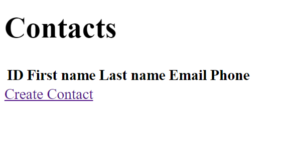
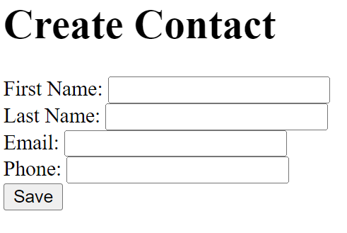
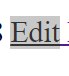
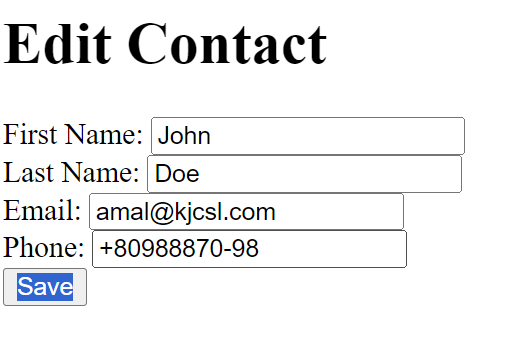
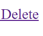

# Contact list

## SkillBoxм: проект "Contact list"
Функционал: хранилище контактов, как имя, фамилия, электронная почта и номер телефона.

Реализовано:
1. Веб морда для манипуляции данных пользователей
2. REST версия для манипуляции данных пользователей
3. сновной сервис по работе с контактами

Возможности:

1. Создание через REST (/rest/) или Веб морду.
2. Удаление через  REST (/rest/delete/[Ваш id]) или Веб морду.
3. Обновление контакта через REST (/rest/contacts/[Ваш id]) или Веб морду.
4. Получить ваш контакт через REST (/rest/contacts/[Ваш id]) или Веб морду.
5. Получить всех контактов через REST (/rest/contact) или Веб морду.
   
Стек:
1. Java 20 (Core, Collections)
2. Spring Boot
3. Gradle
4. Lombok
5. Docker
6. PostgeSql

Цели проекта:
1. фреймворка Spring Boot
2. системы сборки Gradle
3. библиотеки Lombok
4. Dependency Injection
5. Docker'изация PostgeSql

## Список методов для REST
- `createContact` – добавление контакта в базу данных
- `updateContact` – обновление контакта в базе данных по его [id]
- `getAll` – вывод списка всех контактов
- `getContactById` – вывод контакта по его [id]
- `deleteContactById` – снос контакта из базы данных по его [id]

## Список функий Веб морд
- `Create Contact` – кнопка для добавление контакта в базу данных
- 
- Поле ввода контакта
- 
- `Edit` – кнопка для обновления контакта в базе данных
- 
- - Поле ввода обновления для контакта
- 
- - `Delete` – кнопка для обновления контакта в базе данных
- 